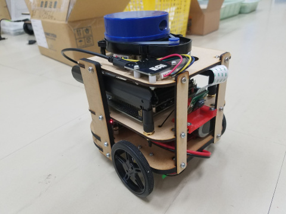
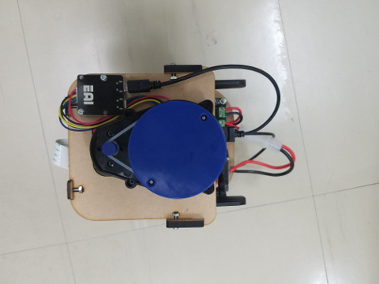
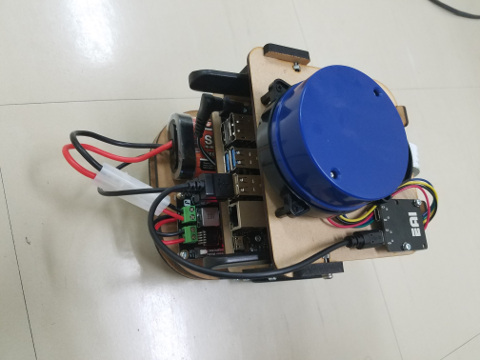

# Microbot

Open source educational robot for Deep Leraning and ROS.

- [Micorbot Manual](https://github.com/KMiyawaki/lectures/blob/master/ros/robots/jetson_microbot_boot_shutdown.md)
- [Jetson NANO カスタムイメージの作成](jetson_sdk.md)
- [JetCard のインストール](install_jetcard.md)
- [その他のソフトのインストール](setup_details.md)
