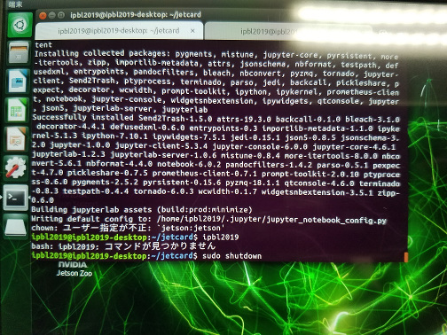
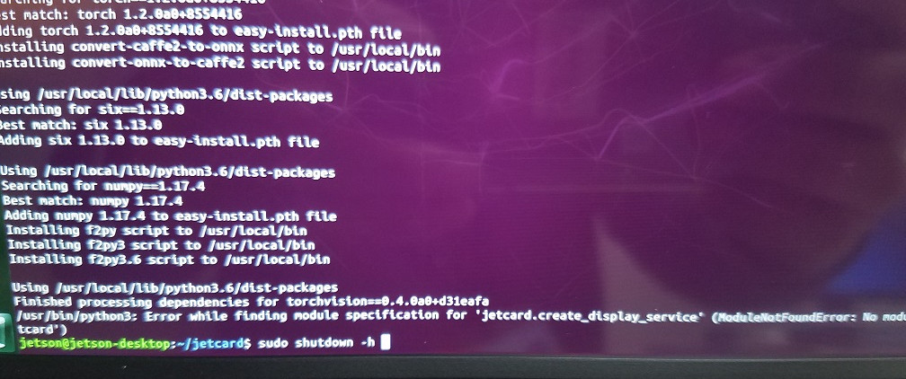
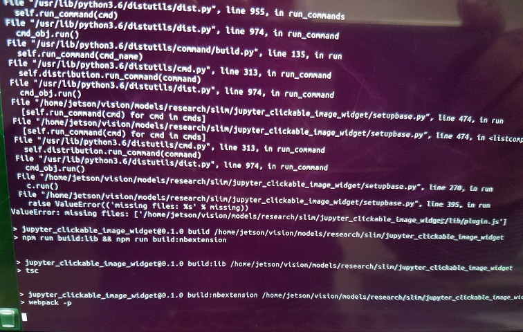

# JetCard のインストール

- JetCard のリポジトリ
  - https://github.com/NVIDIA-AI-IOT/jetcard/tree/jetpack_4.2.2

## Jetson NANO のイメージ書き込み

- Jetson NANO の SD カードイメージは一応、 branch と合わせ、Jetpack 4.2.2 からダウンロードする。
  - https://developer.nvidia.com/embedded/jetpack
  - ファイル名は`nv-jetson-nano-sd-card-image-r32.2.1.zip`
- ユーザ名は`jetson`でないと下記エラーが出る。パスワードは任意と思われるが、`jetson`としておく。



- ネットワーク接続後、下記を先に実行しておく。
  - https://github.com/NVIDIA-AI-IOT/jetcard/blob/jetpack_4.2.2/install.sh#L12
  - https://github.com/NVIDIA-AI-IOT/jetcard/blob/jetpack_4.2.2/install.sh#L54

```shell
sudo apt-get update
sudo apt install -y python3-pip python3-pil python3-smbus python3-matplotlib cmake
cd
git clone https://github.com/NVIDIA-AI-IOT/jetcard.git
cd jetcard
git checkout -b jetpack_4.2.2 origin/jetpack_4.2.2
sudo python3 setup.py install
```

## JetCard インストール時のポイント

- 後は https://github.com/NVIDIA-AI-IOT/jetcard/tree/jetpack_4.2.2 に従って、`install.sh`を実行すればよい。
  - おおよそ３，４時間程度。
- 上記で`sudo python3 setup.py install`をしていないと、次のエラーが出る可能性がある。



- インストール中に下記エラーが出るが、問題はない。
  - [missing files: ['..../plugin.js'] error #1](https://github.com/jaybdub/jupyter_clickable_image_widget/issues/1)


