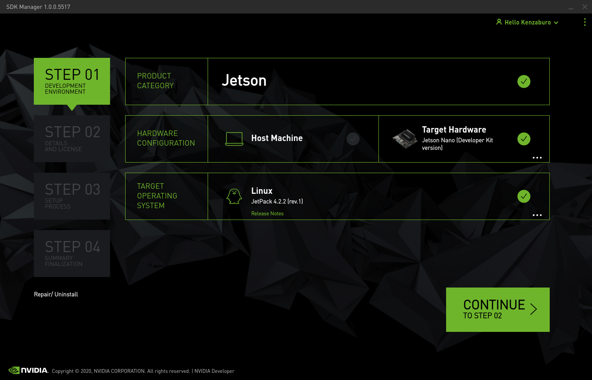
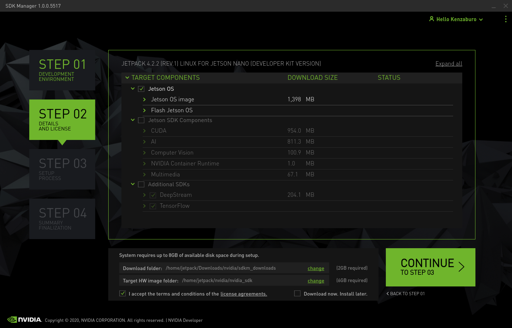

# NVIDIA SDK manager & docker

## Docker をインストール

- https://qiita.com/myyasuda/items/cb8e076f4dba5c41afbc
- `docker`グループに参加し、再起動する

```shell
$ sudo usermod -aG docker `whoami`
$ sudo reboot
```

- `docker ps`で以下のような出力があれば OK。

```shell
$ docker ps
CONTAINER ID        IMAGE               COMMAND             CREATED             STATUS              PORTS               NAMES
```

## 事前に大容量の領域を確保する

- ツインドライブ構成 PC の HDD に Linux 領域を作成するなど。
- `/etc/fstab`に設定を書き、マウントしておく。ここでは`/hdd`にその領域をマウントしたとして進める。
- Docker イメージの置き場所を大容量領域に変える。
  - https://qiita.com/elm200/items/43497f76cbdd19c47d8b

```shell
$ sudo systemctl stop docker.service
$ sudo mv /var/lib/docker /hdd
$ cd /etc/docker
$ sudo emacs daemon.json -nw
```

- `daemon.json`の内容は次の通り

```json
{
  "data-root": "/hdd/docker"
}
```

## Docker イメージを作成する

- `Dockerfile`をクローン

```shell
$ cd /hdd
$ git clone https://github.com/atinfinity/sdk_manager_docker.git
```

- https://developer.nvidia.com/nvidia-sdk-manager から`NVIDIA SDK Manager`バイナリをダウンロード

  - NVIDIA Developper のアカウント必要。
  - `sdkmanager_1.0.0-5517_amd64.deb` (2020/01/29 時点) このファイルを上記`sdk_manager_docker`に移動させておく。

- Docker イメージのビルド

```shell
$ cd sdk_manager_docker
$ docker build --build-arg SDK_MANAGER_VERSION=1.0.0-5517 -t jetpack .
```

- イメージの確認
  - `docker images`コマンド

```shell
$ docker images
REPOSITORY          TAG                 IMAGE ID            CREATED             SIZE
jetpack             latest              67e7931be86e        5 minutes ago       811MB
ubuntu              18.04               ccc6e87d482b        13 days ago         64.2MB
```

- Docker コンテナから X サーバーへの通信を許可する。
  - https://unskilled.site/docker%E3%82%B3%E3%83%B3%E3%83%86%E3%83%8A%E3%81%AE%E4%B8%AD%E3%81%A7gui%E3%82%A2%E3%83%97%E3%83%AA%E3%82%B1%E3%83%BC%E3%82%B7%E3%83%A7%E3%83%B3%E3%82%92%E8%B5%B7%E5%8B%95%E3%81%95%E3%81%9B%E3%82%8B/
  - ホストマシン起動時に毎回必要。

```shell
$ xhost local:
non-network local connections being added to access control list
```

- ホストマシンのディレクトリを永続化領域として指定する。
  - `sdk_manager_docker/launch_container.sh`に追記してコンテナで作成したデータが消えないようにする。

```text
docker run --privileged --rm -it \
           --volume=$XSOCK:$XSOCK:rw \
           --volume=$XAUTH:$XAUTH:rw \
           --volume=/dev:/dev:rw \
           --volume=/hdd:/hdd:rw \ # 追記
```

## SDK Manager の起動

- ホストマシンのディスク容量をチェック

```shell
$ df -alh
/dev/nvme0n1p5   94G   21G   69G  24% /     # SSD 領域。ここは使わないようになっているはず。
/dev/sda2       393G  1.1G  372G   1% /hdd  # Dockerイメージを作成したHDD領域。
```

- コンテナ起動

```shell
$ cd /hdd/sdk_manager_docker
$ ./launch_container.sh
```

- コンテナ側で SDK Manager 起動

```shell
$ sdkmanager
```

- Step 1
  - Host Machine のチェックを外す。
  - Target Hardware を Jetson NANO (Developper kit version)にする。
  - Target Operating System を JetPack 4.2.2 (rev. 1) にする。
    - Jetcard のブランチ名に合わせているだけ。



- Step 2
  - Jetson SDK Components のチェックを外す。



- Step 3
  - ダウンロードが始まる。

## イメージ作成に必要なファイルを抽出する

- Docker コンテナで SDK Manager によりダウンロードしたファイル群から必要なものをコピーする。

```shell
$ cd /hdd
$ mkdir nano_sd_image
$ cd nano_sd_image/
$ sudo cp -ra ~/nvidia/nvidia_sdk/JetPack_4.2.2_Linux_GA_P3448/Linux_for_Tegra/. ./
$ cp rootfs/etc/systemd/nvresizefs.sh ./
$ sudo cp rootfs/etc/systemd/system/nvresizefs.service ./
$ sudo rm -rf /hdd/nano_sd_image/rootfs/*
```

## コピーもとの Jetson NANO SD カードからデータを抽出する

- Docker 側で作成した`nano_sd_image`ディレクトリを**ホスト側**で確認する。

```shell
$ cd /hdd
$ ls
docker  nano_sd_image  sdk_manager_docker
$ cd /hdd/nano_sd_image
$ df -BG|grep media
/dev/sdb1           118G   24G       89G  22% /media/<ユーザ名>/<デバイス名>
$ sudo cp -ra /media/<ユーザ名>/<デバイス名>/. rootfs/
```

## コンテナ側でイメージを作成する

- 自動拡張スクリプトの補充

```shell
$ cd /hdd/nano_sd_image
$ sudo cp nvresizefs.sh rootfs/etc/systemd/
$ sudo cp nvresizefs.service rootfs/etc/systemd/system/
$ sudo ln -s rootfs/etc/systemd/system/nvresizefs.service rootfs/etc/systemd/system/multi-user.target.wants/nvresizefs.service
```

- sgdisk コマンドのために gdisk をインストール

```shell
$ sudo apt-get install -y gdisk
```

- イメージの作成（10 分程度）
  - `df -BG|grep media`で得られた使用済み容量より大きい値を`./create-jetson-nano-sd-card-image.sh`の引数に指定する。

```shell
$ cd /hdd/nano_sd_image
$ sudo ./create-jetson-nano-sd-card-image.sh -o backup.img -s 25G -r 200 # 25G はSDカードの使用済み容量より大きい値を設定する。
********************************************
     Jetson-Nano SD Image Creation Tool
********************************************
create-jetson-nano-sd-card-image.sh - creating backup.img of 25G...
0+0 records in
0+0 records out
0 bytes copied, 4.3765e-05 s, 0.0 kB/s
create-jetson-nano-sd-card-image.sh - creating signed images
・・・
Allocating group tables: done
Writing inode tables: done
Creating journal (32768 blocks): done
Writing superblocks and filesystem accounting information: done


********************************************
   Jetson-Nano SD Image Creation Complete
********************************************
```

- 完成したイメージを[Etcher](https://www.balena.io/etcher/)などで別の SD に焼く。

## 補足

- Docker イメージの削除
  - https://qiita.com/tifa2chan/items/e9aa408244687a63a0ae
